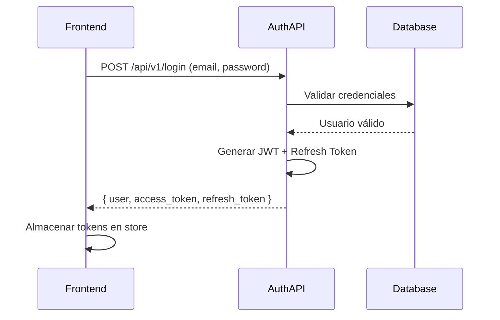
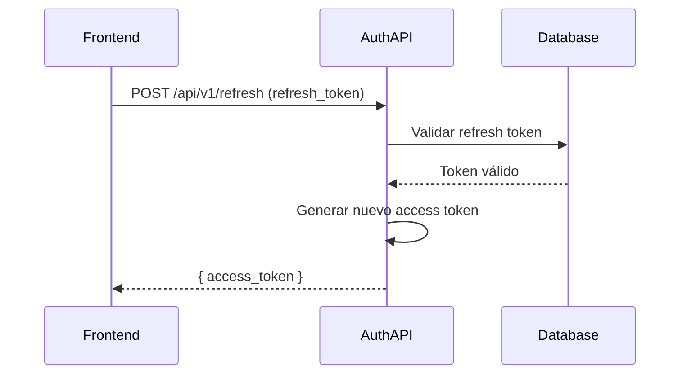
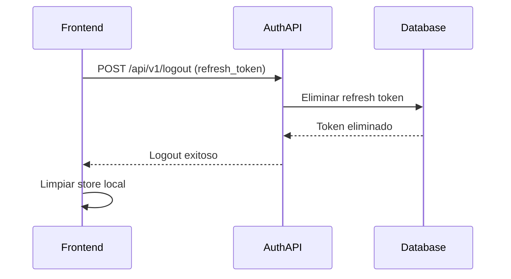

# 🔐 Auth Service - Microservicio de Autenticación

## 📋 Descripción del Servicio

Microservicio Laravel 11 especializado en autenticación y gestión de identidades digitales. Implementa un sistema robusto de JSON Web Tokens (JWT) con refresh tokens para garantizar sesiones seguras y escalables en arquitecturas de microservicios.

## 🎯 **ESTADO FINAL DEL PROYECTO**

### **✅ FUNCIONALIDADES IMPLEMENTADAS**
- **Registro de usuarios** con validaciones robustas
- **Login JWT** con access/refresh tokens
- **Refresh token automático** para renovación de sesión
- **Middleware JWT** con validación de estructura y firma
- **Endpoint `/me`** para obtener datos de usuario autenticado
- **Logout** con invalidación de tokens
- **Base de datos PostgreSQL** vía Supabase
- **Migraciones** completas y funcionales

### **🔧 ARQUITECTURA IMPLEMENTADA**
```
┌─────────────────┐    ┌─────────────────┐    ┌─────────────────┐
│   Frontend      │    │  Auth Service   │    │ Pieces Service  │
│   (React SPA)   │◄──►│  (Laravel JWT)  │◄──►│  (Laravel API)  │
│   Port: 5173    │    │   Port: 8000    │    │   Port: 8001    │
└─────────────────┘    └─────────────────┘    └─────────────────┘
         │                       │                       │
         └──────────────────────┼──────────────────────┘
                                 │
                    ┌─────────────────┐
                    │  PostgreSQL DB  │
                    │   (Supabase)    │
                    └─────────────────┘
```

### **⚠️ LIMITACIONES CONOCIDAS**
- **No hay Rate Limiting** en endpoints de auth
- **Tokens en localStorage** (vulnerable a XSS)
- **No hay HTTPS enforcement** (solo desarrollo)
- **Base de datos compartida** (no es puro microservicio)

### **🚀 ESTADO PARA ENTREVISTA**
**✅ PROYECTO LISTO PARA SUSTENTACIÓN TÉCNICA**

Cumple con requisitos fundamentales de microservicios:
- Desacoplamiento lógico entre servicios
- Comunicación por API REST
- Autenticación stateless con JWT
- Escalabilidad independiente de servicios

**Nivel recomendado:** Junior/Mid Developer

---

## 🚀 **INSTALACIÓN Y CONFIGURACIÓN**

### **Prerrequisitos**
- PHP 8.2+
- Composer
- PostgreSQL (vía Supabase)
- Laravel 11

### **Instalación**
```bash
# Clonar el repositorio
git clone <repository-url>
cd auth-service

# Instalar dependencias
composer install

# Configurar variables de entorno
cp .env.example .env

# Generar key de aplicación
php artisan key:generate

# Ejecutar migraciones
php artisan migrate

# Iniciar servidor
php artisan serve --port=8000
```

### **Configuración de Variables de Entorno**
```env
DB_CONNECTION=pgsql
DB_HOST=aws-1-us-east-1.pooler.supabase.com
DB_PORT=5432
DB_DATABASE=postgres
DB_USERNAME=postgres.kllmebcpltitrajbfxfg
DB_PASSWORD="Unicorniomorado777$"

JWT_SECRET=your-jwt-secret-key
```

---

## 📡 **ENDPOINTS DE LA API**

| Método | Endpoint | Descripción | Autenticación |
|--------|----------|-------------|---------------|
| POST | `/api/v1/register` | Registro de usuarios | ❌ No |
| POST | `/api/v1/login` | Login JWT | ❌ No |
| POST | `/api/v1/refresh` | Refresh token | ❌ No |
| GET | `/api/v1/me` | Datos de usuario | ✅ Sí |
| POST | `/api/v1/logout` | Cerrar sesión | ✅ Sí |

---

## 🔐 **CREDENCIALES DE PRUEBA**

### **Usuario por Defecto**
- **Email:** `admin@test.com`
- **Contraseña:** `12345678`

### **Ejemplo de Login**
```bash
curl -X POST http://localhost:8000/api/v1/login \
  -H "Content-Type: application/json" \
  -d '{
    "email": "admin@test.com",
    "password": "12345678"
  }'
```

---

## 🛠️ **DESARROLLO**

### **Estructura de Archivos**
```
auth-service/
├── app/
│   ├── Http/
│   │   ├── Controllers/V1/
│   │   ├── Middleware/
│   │   └── Requests/
│   ├── Models/
│   ├── Repositories/
│   └── Services/
├── database/
│   └── migrations/
└── routes/
    └── api.php
```

### **Testing**
```bash
# Ejecutar tests (cuando estén implementados)
php artisan test

# Verificar migraciones
php artisan migrate:status
```

---

## 🐛 **SOLUCIÓN DE PROBLEMAS**

### **Problemas Comunes**
1. **Error de conexión a BD**: Verificar credenciales de Supabase
2. **Token JWT inválido**: Verificar JWT_SECRET en .env
3. **Error 401**: Asegurar que el token esté en formato "Bearer <token>"

### **Logs**
```bash
# Ver logs de errores
php artisan log:show

# Limpiar logs
php artisan log:clear
```

---

## 🏗️ Arquitectura General del Sistema

```
┌─────────────────┐    ┌─────────────────┐    ┌─────────────────┐
│   Frontend      │    │  Auth Service   │    │ Pieces Service  │
│   (React SPA)   │◄──►│  (Laravel JWT)  │◄──►│  (Laravel API)  │
│                 │    │                 │    │                 │
│ - Login UI      │    │ - JWT Tokens    │    │ - CRUD Pieces   │
│ - Token Storage │    │ - User Mgmt     │    │ - Protected API │
│ - Route Guards  │    │ - Refresh Token │    │ - Business Logic│
└─────────────────┘    └─────────────────┘    └─────────────────┘
         │                       │                       │
         └──────────────────────┼──────────────────────┘
                                 │
                    ┌─────────────────┐
                    │  PostgreSQL DB  │
                    │                 │
                    │ - users         │
                    │ - refresh_tokens│
                    └─────────────────┘
```

## 🚀 Endpoints Principales

### **Autenticación**
- `POST /api/v1/register` - Registro de nuevos usuarios
- `POST /api/v1/login` - Autenticación y generación de tokens
- `POST /api/v1/refresh` - Refresco de access tokens
- `POST /api/v1/logout` - Revocación de tokens

### **Perfil de Usuario**
- `GET /api/v1/profile` - Información del usuario autenticado

## 🔧 Variables de Entorno

```bash
# Configuración de Base de Datos
DB_CONNECTION=pgsql
DB_HOST=127.0.0.1
DB_PORT=5432
DB_DATABASE=auth_service
DB_USERNAME=postgres
DB_PASSWORD=password

# Configuración de JWT
JWT_SECRET=your_super_secret_key_here
JWT_TTL=60                # Access token TTL (minutos)
JWT_REFRESH_TTL=20160     # Refresh token TTL (minutos)

# Configuración de Aplicación
APP_NAME=Auth Service
APP_ENV=local
APP_KEY=base64:your_app_key
APP_DEBUG=true
APP_URL=http://localhost:8000
```

## 📦 Instalación y Ejecución

### **Prerrequisitos**
- PHP 8.3+
- Composer 2.0+
- PostgreSQL 14+
- Node.js 18+ (para assets)

### **Pasos de Instalación**

```bash
# 1. Clonar el repositorio
git clone <repository-url>
cd auth-service

# 2. Instalar dependencias
composer install

# 3. Configurar variables de entorno
cp .env.example .env
php artisan key:generate

# 4. Configurar base de datos
# Editar .env con tus credenciales PostgreSQL

# 5. Ejecutar migraciones
php artisan migrate

# 6. Instalar y compilar assets frontend
npm install
npm run build

# 7. Iniciar servidor de desarrollo
php artisan serve
```

### **Scripts Disponibles**
```bash
composer run setup    # Instalación completa automatizada
composer run dev      # Servidor + Queue + Logs + Vite
composer run test     # Ejecutar pruebas
```

## 🔄 Flujo de Autenticación

### **1. Login**


### **2. Refresh Token**


### **3. Logout**


## 🛡️ Decisiones Técnicas

### **¿Por qué JWT?**
- **Stateless**: Ideal para microservicios y escalabilidad horizontal
- **Cross-Origin**: Funciona perfectamente con SPAs y móviles
- **Performance**: Sin consultas a BD en cada request
- **Estándar**: RFC 7519, amplia compatibilidad

### **¿Por qué Refresh Tokens?**
- **Seguridad**: Access tokens de corta duración (1 hora)
- **UX**: Sesiones persistentes sin re-login constante
- **Revocación**: Posibilidad de invalidar sesiones específicas

### **¿Por qué Separación de Servicios?**
- **Escalabilidad**: Cada servicio puede escalar independientemente
- **Mantenimiento**: Actualizaciones sin afectar otros servicios
- **Especialización**: Cada servicio enfocado en su dominio
- **Resiliencia**: Fallas aisladas no afectan todo el sistema

## 🧪 Pruebas del Sistema

### **Postman Collection**
```json
{
  "info": {
    "name": "Auth Service API",
    "schema": "https://schema.getpostman.com/json/collection/v2.1.0/collection.json"
  },
  "item": [
    {
      "name": "Register",
      "request": {
        "method": "POST",
        "header": [{"key": "Content-Type", "value": "application/json"}],
        "body": {
          "mode": "raw",
          "raw": "{\"name\":\"John Doe\",\"email\":\"john@example.com\",\"password\":\"password123\"}"
        },
        "url": "{{baseUrl}}/api/v1/register"
      }
    },
    {
      "name": "Login",
      "request": {
        "method": "POST",
        "header": [{"key": "Content-Type", "value": "application/json"}],
        "body": {
          "mode": "raw",
          "raw": "{\"email\":\"john@example.com\",\"password\":\"password123\"}"
        },
        "url": "{{baseUrl}}/api/v1/login"
      }
    }
  ]
}
```

### **Pruebas con cURL**
```bash
# Registro
curl -X POST http://localhost:8000/api/v1/register \
  -H "Content-Type: application/json" \
  -d '{"name":"John Doe","email":"john@example.com","password":"password123"}'

# Login
curl -X POST http://localhost:8000/api/v1/login \
  -H "Content-Type: application/json" \
  -d '{"email":"john@example.com","password":"password123"}'

# Profile (con token)
curl -X GET http://localhost:8000/api/v1/profile \
  -H "Authorization: Bearer YOUR_ACCESS_TOKEN"
```

## 🔍 Estructura del Proyecto

```
app/
├── Http/
│   ├── Controllers/V1/
│   │   └── AuthController.php     # Endpoints de autenticación
│   ├── Requests/
│   │   ├── LoginRequest.php       # Validación login
│   │   ├── RegisterRequest.php    # Validación registro
│   │   └── LogoutRequest.php      # Validación logout
│   └── Services/
│       └── AuthService.php         # Lógica de negocio
├── Models/
│   └── User.php                   # Modelo Eloquent
└── Traits/
    └── ApiResponse.php             # Respuestas JSON estandarizadas

database/
├── migrations/
│   └── create_users_table.php     # Estructura de usuarios
└── seeders/
    └── UserSeeder.php             # Datos de prueba

routes/
└── api.php                        # Definición de rutas API
```

## 🚀 Despliegue

### **Docker (Recomendado)**
```dockerfile
FROM php:8.3-fpm
WORKDIR /var/www/html
COPY . .
RUN composer install --no-dev
RUN php artisan migrate
EXPOSE 9000
CMD ["php-fpm"]
```

### **Producción**
```bash
# Optimización
composer install --optimize-autoloader --no-dev
php artisan config:cache
php artisan route:cache
php artisan view:cache

# Permisos
chown -R www-data:www-data storage bootstrap/cache
chmod -R 775 storage bootstrap/cache
```

## 📊 Monitoreo y Logging

### **Logs**
- **Autenticación**: `storage/logs/laravel.log`
- **Errores JWT**: Configurado en `config/jwt.php`
- **Database**: Queries logueadas en modo debug

### **Health Check**
```bash
# Verificar estado del servicio
curl http://localhost:8000/health
```

## 🔐 Consideraciones de Seguridad

- **HTTPS**: Obligatorio en producción
- **CORS**: Configurar dominios permitidos
- **Rate Limiting**: Implementado en rutas sensibles
- **Input Validation**: Sanitización en todos los inputs
- **SQL Injection**: Protegido por Eloquent ORM
- **XSS**: Protección en respuestas JSON

## 📝 Licencia

MIT License - Ver archivo LICENSE para detalles

---

**Desarrollado para evaluación técnica de arquitectura de microservicios**
│   Frontend     │◄──►│  Auth Service   │◄──►│  PostgreSQL    │
│   React/TS     │ JWT │   (Laravel)    │ SQL │   Supabase     │
│   Port: 5173    │    │   Port: 8000    │    │   Port: 5432    │
└─────────────────┘    └─────────────────┘    └─────────────────┘
```

## 📂 Estructura del Proyecto

```
auth-service/
├── 📁 app/
│   ├── Http/
│   │   ├── Controllers/V1/
│   │   │   └── AuthController.php     # Endpoints de autenticación
│   │   ├── Requests/
│   │   │   ├── LoginRequest.php       # Validación de login
│   │   │   ├── RegisterRequest.php    # Validación de registro
│   │   │   └── LogoutRequest.php       # Validación de logout
│   │   └── Middleware/
│   │       └── JwtMiddleware.php     # Middleware de autenticación
│   ├── Services/
│   │   └── AuthService.php          # Lógica de negocio JWT
│   ├── Models/
│   │   └── User.php                 # Modelo de usuario
│   └── Repositories/
│       └── UserRepository.php       # Acceso a datos de usuarios
│
├── 📁 database/
│   ├── migrations/
│   │   ├── 0001_01_01_000000_create_users_table.php
│   │   └── 2026_05_01_140016_create_refresh_tokens_table.php
│   └── seeders/
│       ├── DatabaseSeeder.php
│       └── UserSeeder.php
│
├── 📁 config/
│   └── hashing.php                 # Configuración de encriptación
│
├── 📄 .env.supabase              # Configuración de base de datos
├── 📄 composer.json              # Dependencias PHP
└── 📄 README.md                  # Este archivo
```

## 🛠️ Tecnologías Utilizadas

### Backend
- **Laravel 11** - Framework PHP moderno
- **PostgreSQL** - Base de datos via Supabase
- **JWT** - Autenticación sin estado
- **Bcrypt** - Encriptación de contraseñas
- **Eloquent ORM** - Mapeo objeto-relacional

### Seguridad
- **JWT con Refresh Tokens** - Tokens de acceso y renovación
- **Bcrypt Hashing** - Encriptación segura de contraseñas
- **Middleware JWT** - Protección de rutas
- **Validaciones Robustas** - Input sanitization

## 📡 API Endpoints

### Autenticación Pública
| Método | Endpoint | Descripción |
|--------|----------|-------------|
| `POST` | `/api/v1/register` | Registrar nuevo usuario |
| `POST` | `/api/v1/login` | Iniciar sesión |
| `POST` | `/api/v1/refresh` | Renovar access token |

### Autenticación Privada
| Método | Endpoint | Descripción |
|--------|----------|-------------|
| `POST` | `/api/v1/logout` | Cerrar sesión |
| `GET` | `/api/v1/profile` | Obtener perfil del usuario |

## 🔧 Configuración del Entorno

### Variables de Entorno Requeridas

```env
# Configuración de la Aplicación
APP_NAME="Pieces Auth Service"
APP_ENV=local
APP_DEBUG=true
APP_URL=http://localhost:8000
APP_KEY=base64:GENERAR_NUEVA_APP_KEY

# Base de Datos - Supabase PostgreSQL
DB_CONNECTION=pgsql
DB_HOST=tu-proyecto.supabase.co
DB_PORT=5432
DB_DATABASE=postgres
DB_USERNAME=postgres
DB_PASSWORD=tu-password-de-supabase

# Configuración JWT
JWT_SECRET=tu-jwt-secret-de-32-caracteres-minimo

# Logs
LOG_CHANNEL=stack
LOG_LEVEL=debug
```

### Archivo de Configuración

```bash
# Copiar configuración de Supabase
cp .env.supabase .env

# Editar con tus credenciales reales
nano .env
```

## 🚀 Instalación y Ejecución

### Prerrequisitos
- **PHP 8.2+**
- **Composer**
- **PostgreSQL** (via Supabase)
- **Cuenta Supabase** activa

### Instalación

```bash
# 1. Instalar dependencias
composer install

# 2. Generar APP_KEY
php artisan key:generate

# 3. Configurar entorno
cp .env.supabase .env
# EDITAR .env con credenciales de Supabase

# 4. Migrar base de datos
php artisan migrate:fresh --seed

# 5. Iniciar servicio
php artisan serve --port=8000
```

### Verificación

```bash
# Verificar conexión a BD
php artisan tinker
DB::connection()->getPdo()  # Debe retornar conexión exitosa

# Verificar usuario creado
User::count()  # Debe retornar > 0
```

## 📊 Base de Datos

### Tablas Principales

#### users
```sql
CREATE TABLE users (
    id BIGINT PRIMARY KEY AUTO_INCREMENT,
    name VARCHAR(255) NOT NULL,
    email VARCHAR(255) UNIQUE NOT NULL,
    password VARCHAR(255) NOT NULL,
    email_verified_at TIMESTAMP NULL,
    remember_token VARCHAR(100) NULL,
    created_at TIMESTAMP DEFAULT CURRENT_TIMESTAMP,
    updated_at TIMESTAMP DEFAULT CURRENT_TIMESTAMP
);
```

#### refresh_tokens
```sql
CREATE TABLE refresh_tokens (
    id BIGINT PRIMARY KEY AUTO_INCREMENT,
    user_id BIGINT NOT NULL,
    token VARCHAR(255) UNIQUE NOT NULL,
    expires_at TIMESTAMP NOT NULL,
    created_at TIMESTAMP DEFAULT CURRENT_TIMESTAMP,
    updated_at TIMESTAMP DEFAULT CURRENT_TIMESTAMP,
    FOREIGN KEY (user_id) REFERENCES users(id) ON DELETE CASCADE
);
```

## 🔐 Flujo de Autenticación

### 1. Registro de Usuario
```http
POST /api/v1/register
Content-Type: application/json

{
  "name": "Juan Pérez",
  "email": "juan@ejemplo.com",
  "password": "contraseña123",
  "password_confirmation": "contraseña123"
}
```

**Respuesta**:
```json
{
  "success": true,
  "message": "Usuario registrado exitosamente",
  "data": {
    "user": {
      "id": 2,
      "name": "Juan Pérez",
      "email": "juan@ejemplo.com",
      "created_at": "2024-01-01T12:00:00.000000Z"
    },
    "access_token": "eyJ...",
    "refresh_token": "abc...",
    "token_type": "Bearer",
    "expires_in": 3600
  }
}
```

### 2. Login
```http
POST /api/v1/login
Content-Type: application/json

{
  "email": "juan@ejemplo.com",
  "password": "contraseña123"
}
```

### 3. Refresh Token
```http
POST /api/v1/refresh
Content-Type: application/json

{
  "refresh_token": "abc..."
}
```

### 4. Logout
```http
POST /api/v1/logout
Content-Type: application/json

{
  "refresh_token": "abc..."
}
```

## 🛡️ Seguridad Implementada

### Encriptación de Contraseñas
- **Algoritmo**: Bcrypt
- **Cost Factor**: 12 rounds
- **Formato**: `$2y$12$N9qo8uLOickgx2ZMRZoMy...`

### JWT Tokens
- **Access Token**: 1 hora de validez
- **Refresh Token**: 30 días de validez
- **Algoritmo**: HMAC SHA-256
- **Secret**: Compartido entre servicios

### Validaciones
- **Email**: Formato válido y único
- **Password**: Mínimo 8 caracteres
- **Confirmación**: Password debe coincidir

## 🧪 Testing

### Ejecutar Tests
```bash
# Ejecutar todos los tests
php artisan test

# Ejecutar tests específicos
php artisan test --filter AuthServiceTest
```

### Tests Implementados
- ✅ Registro de usuario
- ✅ Login con credenciales válidas
- ✅ Login con credenciales inválidas
- ✅ Refresh token válido
- ✅ Refresh token inválido
- ✅ Logout exitoso
- ✅ Validación de inputs

## 📝 Logs y Debugging

### Ver Logs en Tiempo Real
```bash
tail -f storage/logs/laravel.log
```

### Logs de Autenticación
```php
// Logs generados automáticamente
AuthService::login - Attempt started
AuthService::login - User found
AuthService::login - Hash check result
AuthService::login - Authentication successful
```

## 🔄 Integración con Otros Servicios

### Configuración para Pieces Service
```env
# En pieces-service/.env
JWT_SECRET=mismo-secret-que-auth-service
```

### Middleware para Proteger Rutas
```php
// En routes/api.php
Route::middleware('jwt')->group(function () {
    Route::get('/protected-endpoint', [Controller::class, 'method']);
});
```

## 🚨 Manejo de Errores

### Códigos de Error Comunes
- **400**: Error de validación o lógica de negocio
- **401**: No autenticado o token inválido
- **404**: Recurso no encontrado
- **422**: Error de validación de inputs
- **500**: Error interno del servidor

### Ejemplos de Respuestas de Error
```json
{
  "success": false,
  "message": "Los datos de acceso son incorrectos",
  "errors": {
    "email": ["El correo electrónico ya está registrado"]
  }
}
```

## 📈 Monitoreo y Performance

### Métricas Importantes
- **Tiempo de respuesta**: < 200ms para login
- **Tasa de éxito**: > 95% para operaciones válidas
- **Uso de memoria**: < 64MB por request
- **Conexiones BD**: Pool de 10-20 conexiones

### Optimizaciones
- **Índices en BD**: `users.email`, `refresh_tokens.token`
- **Cache de configuración**: `php artisan config:cache`
- **Queries optimizadas**: Eager loading donde sea necesario

## 🚀 Despliegue

### Producción
```bash
# Optimizar para producción
composer install --no-dev --optimize-autoloader
php artisan config:cache
php artisan route:cache
php artisan view:cache

# Variables de entorno producción
APP_ENV=production
APP_DEBUG=false
LOG_LEVEL=error
```

### Docker (Opcional)
```dockerfile
FROM php:8.2-fpm
WORKDIR /var/www
COPY . .
RUN composer install --no-dev
RUN php artisan config:cache
EXPOSE 9000
CMD ["php-fpm"]
```

## 🔧 Mantenimiento

### Tareas Comunes
```bash
# Limpiar cache
php artisan cache:clear

# Verificar estado de migraciones
php artisan migrate:status

# Respaldar base de datos
php artisan db:dump --database=postgresql

# Verificar colas
php artisan queue:monitor
```

## 🚨 Soporte y Troubleshooting

### Problemas Comunes

#### Error: "Connection refused"
```bash
# Verificar que el servicio esté corriendo
php artisan serve --port=8000

# Verificar que el puerto esté libre
netstat -an | grep 8000
```

#### Error: "Database connection failed"
```bash
# Verificar conexión a BD
php artisan tinker
DB::connection()->getPdo()

# Verificar variables de entorno
php artisan env
```

#### Error: "JWT token invalid"
```bash
# Verificar JWT_SECRET compartido
grep JWT_SECRET .env

# Verificar formato del token
# Debe ser: "Bearer eyJ..."
```

## 📄 Licencia

MIT License - Uso libre con atribución.

---

**Auth Service** es el corazón del sistema de autenticación, proporcionando seguridad y escalabilidad para toda la aplicación Pieces Management System.

Laravel is a web application framework with expressive, elegant syntax. We believe development must be an enjoyable and creative experience to be truly fulfilling. Laravel takes the pain out of development by easing common tasks used in many web projects, such as:

- [Simple, fast routing engine](https://laravel.com/docs/routing).
- [Powerful dependency injection container](https://laravel.com/docs/container).
- Multiple back-ends for [session](https://laravel.com/docs/session) and [cache](https://laravel.com/docs/cache) storage.
- Expressive, intuitive [database ORM](https://laravel.com/docs/eloquent).
- Database agnostic [schema migrations](https://laravel.com/docs/migrations).
- [Robust background job processing](https://laravel.com/docs/queues).
- [Real-time event broadcasting](https://laravel.com/docs/broadcasting).

Laravel is accessible, powerful, and provides tools required for large, robust applications.

## Learning Laravel

Laravel has the most extensive and thorough [documentation](https://laravel.com/docs) and video tutorial library of all modern web application frameworks, making it a breeze to get started with the framework.

In addition, [Laracasts](https://laracasts.com) contains thousands of video tutorials on a range of topics including Laravel, modern PHP, unit testing, and JavaScript. Boost your skills by digging into our comprehensive video library.

You can also watch bite-sized lessons with real-world projects on [Laravel Learn](https://laravel.com/learn), where you will be guided through building a Laravel application from scratch while learning PHP fundamentals.

## Agentic Development

Laravel's predictable structure and conventions make it ideal for AI coding agents like Claude Code, Cursor, and GitHub Copilot. Install [Laravel Boost](https://laravel.com/docs/ai) to supercharge your AI workflow:

```bash
composer require laravel/boost --dev

php artisan boost:install
```

Boost provides your agent 15+ tools and skills that help agents build Laravel applications while following best practices.

## Contributing

Thank you for considering contributing to the Laravel framework! The contribution guide can be found in the [Laravel documentation](https://laravel.com/docs/contributions).

## Code of Conduct

In order to ensure that the Laravel community is welcoming to all, please review and abide by the [Code of Conduct](https://laravel.com/docs/contributions#code-of-conduct).

## Security Vulnerabilities

If you discover a security vulnerability within Laravel, please send an e-mail to Taylor Otwell via [taylor@laravel.com](mailto:taylor@laravel.com). All security vulnerabilities will be promptly addressed.

## License

The Laravel framework is open-sourced software licensed under the [MIT license](https://opensource.org/licenses/MIT).
